# DevSecFlow-CI-CD-Pipeline: Train Ticket Reservation System - CI/CD Pipeline

## Table of Contents
1. [Overview](#overview)
2. [Features](#features)
3. [Prerequisites](#prerequisites)
4. [Technologies Used](#technologies-used)
5. [Infrastructure Setup](#infrastructure-setup)
   - [AWS EC2 Instance for Jenkins, SonarQube, and Nexus](#aws-ec2-instance-for-jenkins-sonarqube-and-nexus)
   - [EKS Cluster Setup](#eks-cluster-setup)
   - [Service Account & Secrets for Jenkins](#service-account--secrets-for-jenkins)
   - [Private DockerHub Repository & Regcred Secret](#private-dockerhub-repository--regcred-secret)
6. [Pipeline Setup](#pipeline-setup)
7. [Screenshots](#screenshots)

## Overview
The **Train Ticket Reservation System** is a web-based application designed to simplify the process of booking train tickets and gathering information related to train schedules, seat availability, and fare inquiries. The application allows users to register, view available trains, check seat availability, book tickets, and view booking history. Additionally, the application offers an admin interface for managing train schedules, updating train information, and handling reservations.

The project employs a robust **CI/CD pipeline** for continuous integration and deployment using Jenkins, Docker, Kubernetes (EKS), SonarQube, and Nexus. It includes automated testing, static code analysis, file system scanning, image scanning, automatic image tag updation in deployment file, deployment to an EKS cluster, and email notification features. The infrastructure is provisioned using Terraform, and private DockerHub repositories are utilized for securely managing application images.

### Application Key Features:
- Train schedules and availability viewing.
- Secure seat booking.
- Admin management of train schedules.
- Login, logout, and profile management.

### CI/CD Pipeline Features:
- Automated creation of service account and secrets for Jenkins in the EKS cluster.
- Email notifications for successful or failed builds.
- Docker image scanning with Trivy.
- Automatic update of image tags in Kubernetes deployment files.
- Private DockerHub repository for build images.
- Integration with SonarQube for code quality checks.


## Features

1. **Automated CI/CD Pipeline**:
- Integrated Jenkins pipeline that handles code compilation, testing, static analysis with SonarQube, and container security scanning with Trivy.
- Automatic deployment of application updates to an EKS cluster.

2. **DockerHub Integration**:
- Builds application Docker images and publishes them to a private DockerHub repository.
- Automates updating the deployment manifest with the new Docker image tag for Kubernetes deployment.

3. **Email Notification System**:
- Jenkins sends email notifications after every build to notify of success or failure. This includes build status details and a link to the console output.

4. **Service Account and Secrets Automation**:
- A script automates the creation of service accounts and secrets for Jenkins to securely connect to the EKS cluster.

5. **Infrastructure as Code (IaC) with Terraform**:
- Terraform scripts for automating the provisioning of AWS resources like EC2 instances and EKS clusters.


## Prerequisites
To run this project, you need the following:
- Jenkins server configured with Docker, Maven, and necessary plugins.
- AWS account for EC2 and EKS resources.
- Terraform installed for provisioning infrastructure.
- SonarQube and Nexus running as Docker containers in EC2 Instances.
- A private DockerHub repository for hosting container images.
- Distribution Management Configuration in `pom.xml` file.
  
     - Ensure to add your Nexus server public Ip here `http://<nexus-server-pulic-ip>:8081` in this section of the `pom.xml` file
       ```bash
       <!-- Configuration to Deploy both snapshot and releases to Nexus -->
       <distributionManagement>
           <repository>
               <id>maven-releases</id>
               <name>maven-releases</name>
               <url>http://<nexus-server-pulic-ip>:8081/repository/maven-releases/</url>
           </repository>
           <snapshotRepository>
               <id>maven-snapshots</id>
               <name>maven-snapshots</name>
               <url>http://<nexus-server-pulic-ip>:8081/repository/maven-snapshots/</url>
           </snapshotRepository>
       </distributionManagement>
       ```

## Technologies Used
- Jenkins: For automating the CI/CD pipeline.
- Docker: Containerization of applications and SonarQube, Nexus services.
- Kubernetes (EKS): Container orchestration.
- SonarQube: For static code analysis.
- Nexus: Repository manager for storing artifacts.
- Terraform: For provisioning infrastructure as code (IaC).
- Maven: For Java application builds and dependency management.
- Trivy: For scanning Docker images for vulnerabilities.


---
## Infrastructure Setup

### CI: AWS EC2 Instance for Jenkins, SonarQube, and Nexus


#### Manual Procedure for AWS EC2 Instance setup for Jenkins, SonarQube, and Nexus

##### First Option: Using AWS Management Console

Set up three AWS EC2 instances for Jenkins, SonarQube, and Nexus.
Launch 3 EC2 instances (Ubuntu) in AWS but ensure you add these user-data for each instance during creation to install necessary dependencies.

- **User Data for EC2 Instance dependency installation**:

To add the **User Data** script during the EC2 instance creation, follow these steps:

   - **Log in to AWS Management Console** and navigate to **EC2**.
   - Click on **Launch Instance**.
   - Choose the **Amazon Machine Image (AMI)** and **Instance Type**, then proceed to **Configure Instance Details**.
   - Scroll down to the **Advanced Details** section.
   - In the **User data** field, add your script or commands:
   
   - **For Jenkins:**
   ```bash  
    #!/bin/bash

    # Update the package list
    sudo apt-get update -y

    # Install Java
    sudo apt-get install -y openjdk-17-jre-headless

    # Jenkins installation process
    echo "Installing Jenkins package..."
    sudo wget -O /usr/share/keyrings/jenkins-keyring.asc https://pkg.jenkins.io/debian-stable/jenkins.io-2023.key
    echo "deb [signed-by=/usr/share/keyrings/jenkins-keyring.asc] https://pkg.jenkins.io/debian-stable binary/" | sudo tee /etc/apt/sources.list.d/jenkins.list > /dev/null
    sudo apt-get update -y
    sudo apt-get install -y jenkins

    # Docker installation
    echo "Installing Docker..."
    sudo apt-get install -y docker.io
    sudo systemctl start docker
    sudo systemctl enable docker
    sudo usermod -aG docker $USER
    sudo chmod 666 /var/run/docker.sock

    sudo usermod -aG docker jenkins

    # Trivy installation
    echo "Installing Trivy..."
    wget https://github.com/aquasecurity/trivy/releases/download/v0.27.1/trivy_0.27.1_Linux-64bit.deb
    sudo dpkg -i trivy_0.27.1_Linux-64bit.deb
   ```

   - **For SonarQube:**
   ```bash
    #!/bin/bash
    sudo apt-get update

    ## Install Docker
    yes | sudo apt-get install docker.io
    sudo systemctl start docker
    sudo systemctl enable docker
    sudo usermod -aG docker $USER
    sudo chmod 666 /var/run/docker.sock
    echo "Waiting for 30 seconds before runing Sonarqube Docker container..."
    sleep 30

    ## Runing Sonarqube in a docker container
    docker run -d -p 9000:9000 --name sonarqube-container sonarqube:lts-community
   ```
   - **For Nexus:**
   ```bash
    #!/bin/bash
    sudo apt-get update

    ## Install Docker
    yes | sudo apt-get install docker.io
    sudo systemctl start docker
    sudo systemctl enable docker
    sudo usermod -aG docker $USER
    sudo chmod 666 /var/run/docker.sock
    echo "Waiting for 30 seconds before running Nexus Docker container..."
    sleep 30

    ## Runing Nexus in a docker container
    docker run -d -p 8081:8081 --name nexus-container sonatype/nexus3:latest
   ```

   - Continue with the remaining steps to configure **Storage**, **Security Groups**, and **Tags**, then launch the instance.


##### Second Option: Using AWS CLI to setup the EC2 Instances
You can also use the `AWS CLI` to setup each of the EC2 Instance:

   ```bash
    aws ec2 run-instances --image-id ami-12345678 --instance-type t2.medium --key-name your-key-pair \
    --security-group-ids sg-12345678 --subnet-id subnet-12345678 --user-data file://userdata.sh
   ```

- **NOTE**:
 - `--image-id ami-12345678`: Specifies the Amazon Machine Image (AMI) ID to use for the instance. This ID represents the OS and software configuration of the instance (e.g., Ubuntu, Amazon Linux).

 - `--instance-type t2.medium`: Specifies the type of instance to create, which determines its CPU, memory, and network performance. `t2.medium` provides moderate resources suitable for small to medium workloads. (You should increase the size for Jenkins instance.)

 - `--key-name your-key-pair`: Specifies the name of the key pair to use for SSH access to the instance. You should have created this key pair in advance within AWS EC2.

 - `--security-group-ids sg-12345678`: Assigns the instance to a security group that controls inbound and outbound traffic rules. Security groups are configured with rules to allow or restrict network access.

 - `--subnet-id subnet-12345678`: Specifies the subnet where the instance will be launched. The subnet should be part of a Virtual Private Cloud (VPC) in which the instance can access resources and network configurations.

 - `--user-data file://userdata.sh`: Supplies the user data script (`userdata.sh` in this case) that will run automatically when the instance starts. If the userdata.sh is in the same directory where you’re running the command, you can reference it as `file://userdata.sh`. Otherwise, provide the full path, e.g., `file:///home/user/scripts/userdata.sh`.


#### Automated setup for the AWS EC2 Instance for Jenkins, SonarQube, and Nexus
 For a fully automated setup of the EC2 Instances using Terraform: 
 Refer to the [Terraform EC2 Setup](https://github.com/Godfrey22152/automation-of-aws-infra-using-terraform-via-Gitlab) for automated setup scripts.


### Configure Installed Tools: `Jenkins`, `SonarQube`, and `Nexus`

### Jenkins
 
Access running `Jenkins` and complete the setup over the browser using the EC2 Instance server `Public IP` at `http://<public-ip>:8080`.
   
- **Access Jenkins Initial Admin Password**:

   ```bash
   sudo cat /var/jenkins_home/secrets/initialAdminPassword
   ```

- **create an account to sign in and Install recommended Plugins**

### SonarQube

- **Access running SonarQube server at `http://<public-ip>:9000`**
- **SonarQube Initial Admin Password Credentials**:
  - Username: `admin`
  - Password: `admin`


### Nexus 
- **Access running Nexus server at `http://<public-ip>:8081`**  
- **Access Nexus Credentials**:
  The default admin password is stored in a file inside the container. Retrieve it by accessing container shell:

     ```bash
     docker exec nexus-container cat /nexus-data/admin.password
     ```


### CD: EKS Cluster Setup
Refer to the repository and guide [here](https://github.com/Godfrey22152/Automated-EKS-Cluster-Deployment-Pipeline/tree/main/aws_eks_terraform_files) for setting up your EKS cluster using terraform. 
 
- **Before you run the terraform scripts**: 
Ensure you have `terraform`, `AWS CLI`, and `kubectl` installed on the server which you will use to create the cluster:

```bash
# Terraform Installation
echo "Installing Terraform..."
wget https://releases.hashicorp.com/terraform/1.6.5/terraform_1.6.5_linux_386.zip
sudo apt-get install -y unzip
unzip terraform_1.6.5_linux_386.zip
sudo mv terraform /usr/local/bin/
```
```bash
# Install Kubectl
curl -LO "https://dl.k8s.io/release/$(curl -L -s https://dl.k8s.io/release/stable.txt)/bin/linux/amd64/kubectl"
curl -LO "https://dl.k8s.io/release/$(curl -L -s https://dl.k8s.io/release/stable.txt)/bin/linux/amd64/kubectl.sha256"
echo "$(cat kubectl.sha256)  kubectl" | sha256sum --check
sudo install -o root -g root -m 0755 kubectl /usr/local/bin/kubectl 
```
```bash
# Install AWS CLI 
sudo apt install unzip 
curl "https://awscli.amazonaws.com/awscli-exe-linux-x86_64.zip" -o "awscliv2.zip"
unzip awscliv2.zip
sudo ./aws/install
```

- **After Installation, Run**: 
```bash
aws configure
# Follow the prompts and provide your "Access key ID" and "Secret Access Key" 
```


**You can also refer to this repository and guide [here](https://github.com/Godfrey22152/Automated-EKS-Cluster-Deployment-Pipeline.git) for automated cluster creation.**


**After setting up, connect to the cluster with**:
```bash
aws eks --region <region> update-kubeconfig --name <cluster-name>

# In our case  
aws eks --region eu-west-1 update-kubeconfig --name odo-eks-cluster
```

### Service Account & Secrets for Jenkins
Create a `service account` in the `webapps` `Namespace` and necessary `secrets` for Jenkins to connect to the EKS cluster:
Use the provided scripts in the `Jenkins_ServiceAccount_RBAC_Scripts` folder for automating service account and secret creation. You can refer to the detailed `README.md` inside the folder.
- Run the automated script `create_jenkins_rbac.sh` available in the Jenkins_ServiceAccount_RBAC_Scripts folder in the repository.
- After creating the secrets, copy the secret as displayed on the screen, add them to Jenkins by navigating to `Manage Jenkins` > `Credentials`. (Select `secret text` and paste the secret)

### Private DockerHub Repository & Regcred Secret
1. Create a DockerHub `private` repository to store your Docker images.
2. Create the `regcred` secret in your EKS cluster to allow Kubernetes to pull images from DockerHub:
   ```bash
   kubectl create secret docker-registry regcred      --docker-server=https://index.docker.io/v1/      --docker-username=your-username      --docker-password=your-password      --namespace=webapps
   ```
   This secret ensures that Kubernetes can securely pull private images from DockerHub.

---

## Pipeline Setup
The Jenkins pipeline includes stages for compiling, testing, static analysis, building, image scanning, updating docker-tag, deploying to the EKS cluster, and Email notification of the builds. To set up the pipeline, follow these basic steps:

   - **Ensure the following plugins are installed and configured:**
   In Jenkins navigate to `Dashboard` > `Manage Jenkins` > `Plugins` > `available plugins` search and install: `Docker`, `Eclipse Temurin installer`, `SonarQube Scanner`, `Config File Provider`, `Maven Integration`, `Pipeline Maven Integration`, `Kubernetes`, `Kubernetes Credentials`, `Kubernetes CLI`, `Kubernetes Client API`, `Pipeline: Stage View`

   - **Clone the repository and navigate to the `jenkins-pipeline` folder.**
- For details on setting up the Jenkins pipeline, refer to the `README.md` file in the `jenkins-pipeline` folder. 

---

## Screenshots

### 1. Deployed TrainBooking application Images.
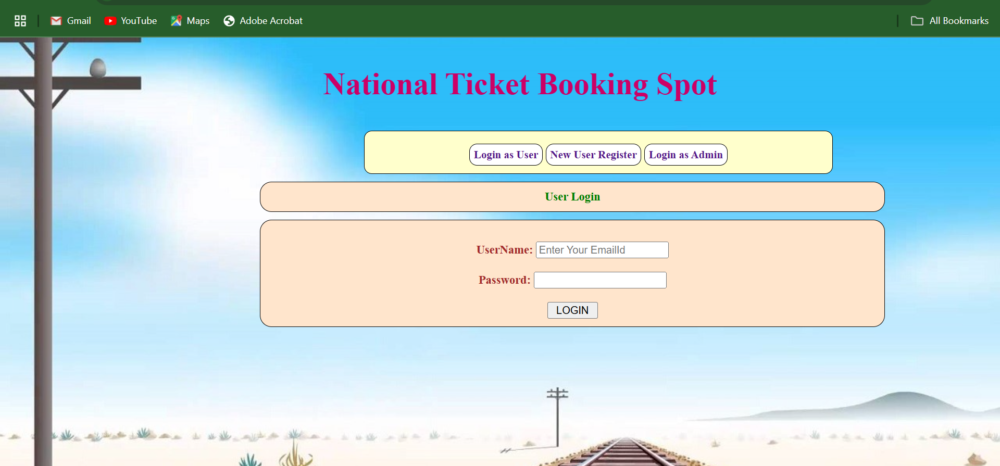
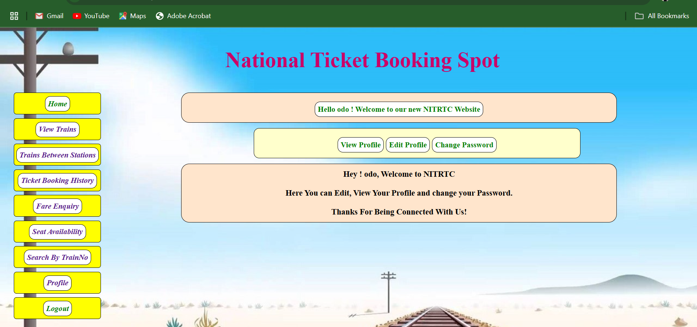
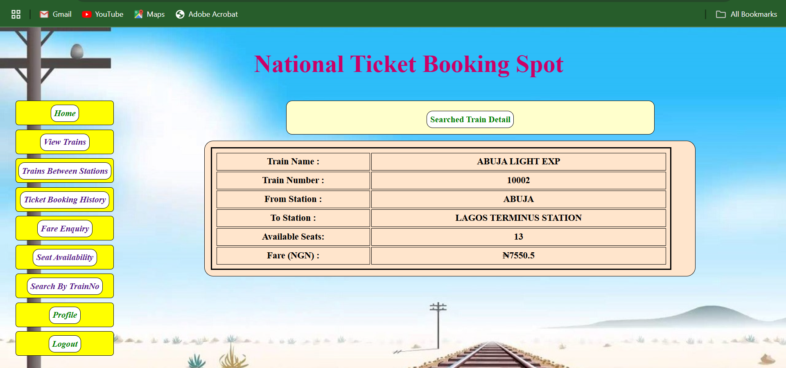
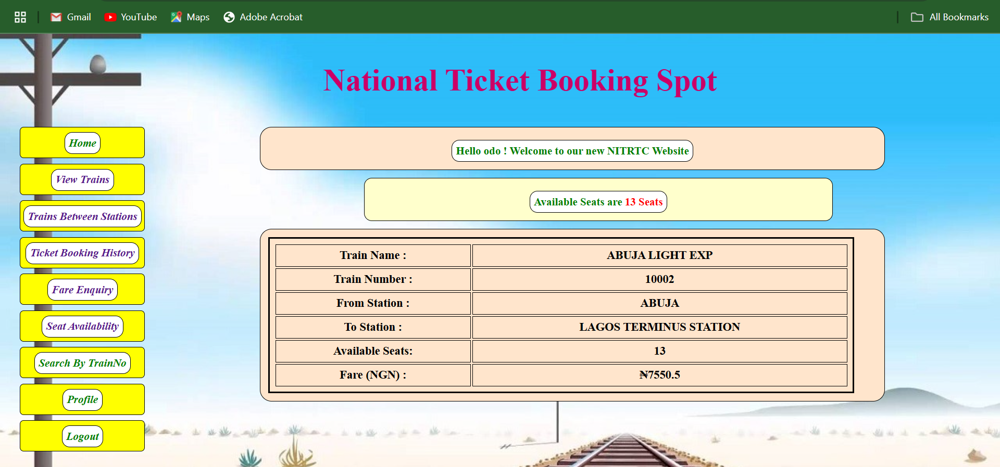
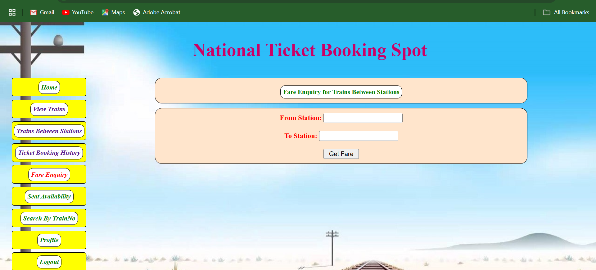
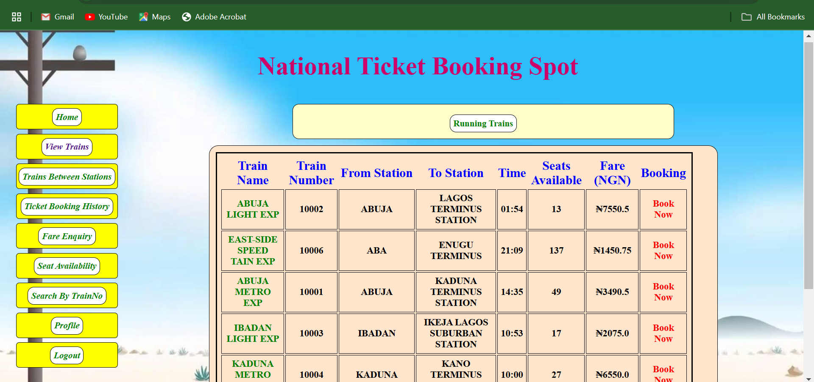
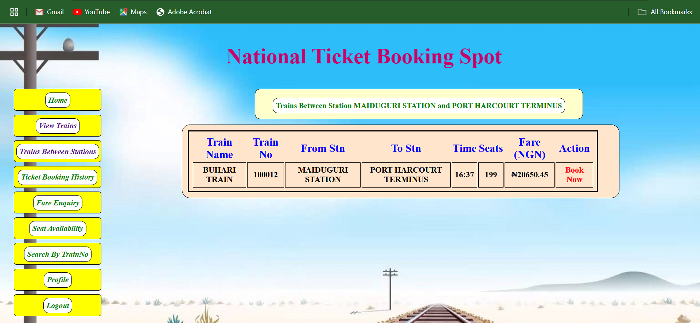 

### 2. Jenkins Dashboard
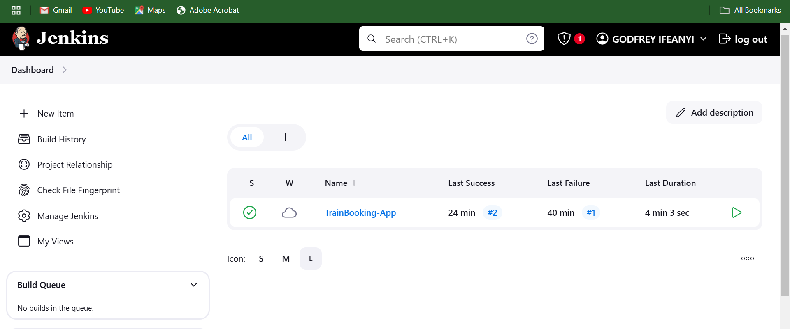
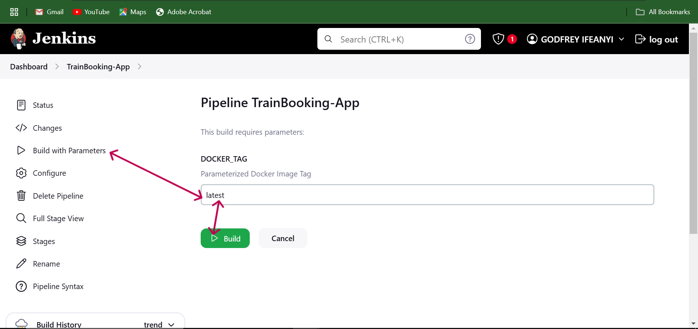

### 3. Jenkins Stage view
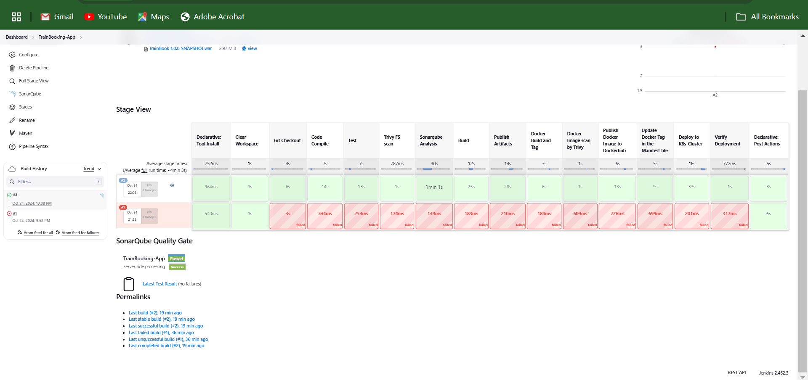
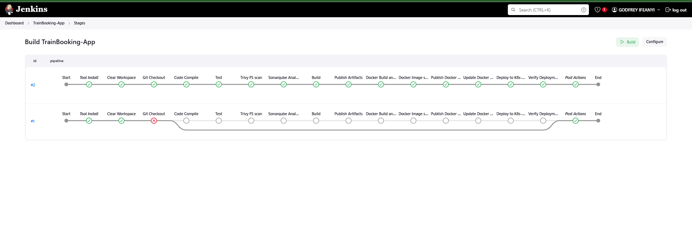

### 4. Nexus Web View
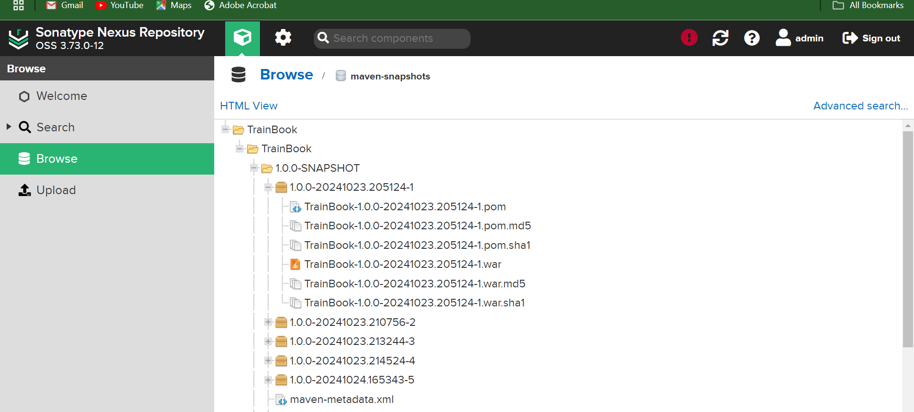

### 5. SonarQube Server Web View
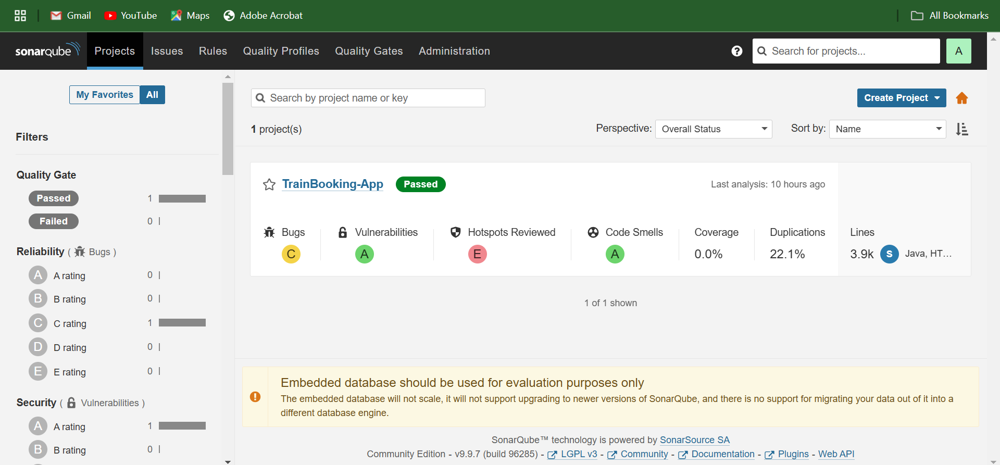


### 6. Jenkins Email Notification on Build Success/Failure.
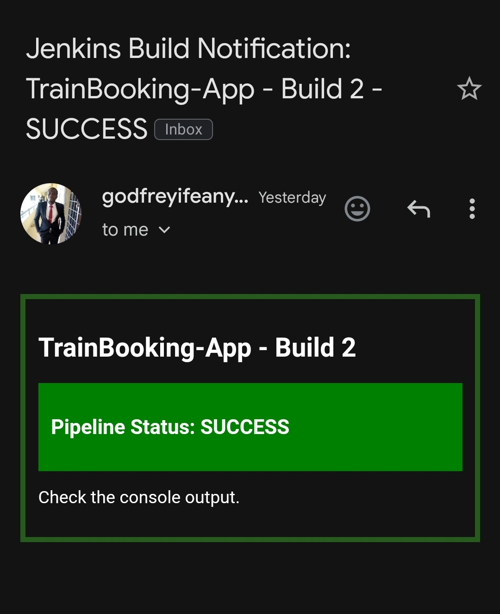

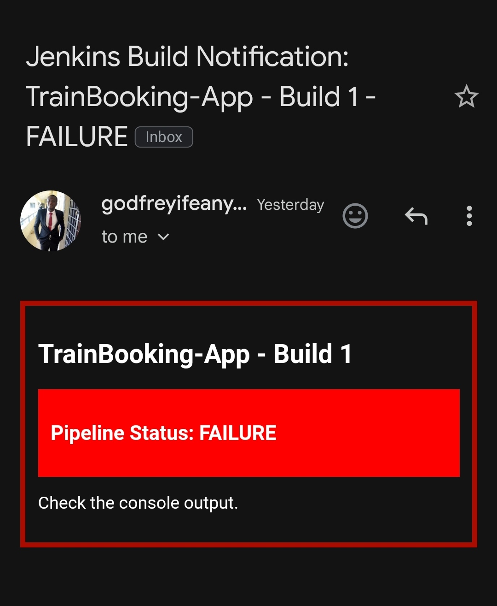 


